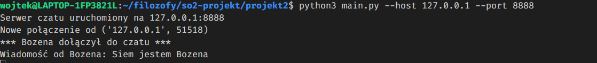
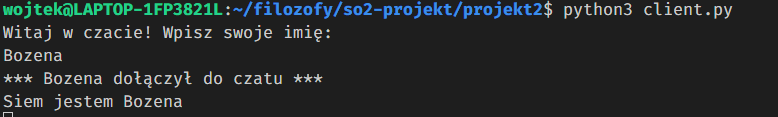

# Problem ucztujących filozofów
Celem projektu było przedstawienie problemu ucztujących filozofów, jako ćwiczenie z synchronizacji wątków (jeden proces - jeden filozof). Aby uniknąć zakleszczenia zastosowano metodę asymetrycznego podnoszenia widelców.

## Narzędzia
Progam został wykonany w języku C++ z użyciem biblioteki threads oraz ncurses (do czytelnego wyświetlania informacji w terminalu).

## Wymagania
- System Linux
- kompilator C++ (g++)
- Cmake
- ncurses

Instalacja zależności
```
sudo apt-get install -y g++ cmake libncurses5-dev libncursesw5-dev
```

## Uruchomienie
Aby uruchomić program musimy nadać uprawnienia wykonania dla pliku `run.sh`
```
chmod +x run.sh
```
Uruchamiamy skrypt z odpowiednimi argumentami
```
./run.sh <liczba_filozofów> <min_czas> <max_czas>
```
- `liczba_filozofów`– Liczba filozofów (i widelców) w symulacji.
- `min_czas` – Minimalny losowy czas (w milisekundach), który filozof spędza na myśleniu/jedzeniu.
- `max_czas` – Maksymalny losowy czas (w milisekundach), który filozof spędza na myśleniu/jedzeniu.

Przykładowe uruchomienie
```
./run.sh 5 1000 3000
```

Aby zakończyć program należy nacisnąć `CTRL + C`


# Wielowątkowy Serwer Czatu

Prosta aplikacja czatu w Pythonie wykorzystująca bibliotekę threading do obsługi wielu klientów jednocześnie. Aplikacja składa się z serwera, który obsługuje połączenia klientów w osobnych wątkach, oraz prostego klienta konsolowego.

## Wymagania

- Python 3.6 lub nowszy

## Uruchamianie

### Uruchomienie serwera

```bash
# Uruchom z domyślnymi parametrami (host: 127.0.0.1, port: 8888)
python3 main.py

# Lub określ własne parametry
python3 main.py --host 0.0.0.0 --port 5000
```

### Uruchomienie klienta

```bash
python3 client.py
```

Po uruchomieniu klienta, należy podać swoją nazwę użytkownika. Po zatwierdzeniu nazwy, można rozpocząć wysyłanie wiadomości.

## Korzystanie z czatu

1. Uruchom serwer w jednym terminalu
2. Uruchom klienta w drugim terminalu (lub wielu terminalach dla wielu klientów)
3. Wpisz nazwę użytkownika gdy zostaniesz o to poproszony
4. Zacznij wpisywać wiadomości i wysyłać je naciskając Enter
5. Aby wyjść z czatu, wpisz `/exit`

## Implementacja synchronizacji

Aplikacja implementuje własną synchronizację za pomocą blokad (locks) z biblioteki threading:

- `clients_lock` - synchronizuje dostęp do listy klientów
- `lock` w `MessageQueue` - synchronizuje dostęp do kolejki wiadomości



